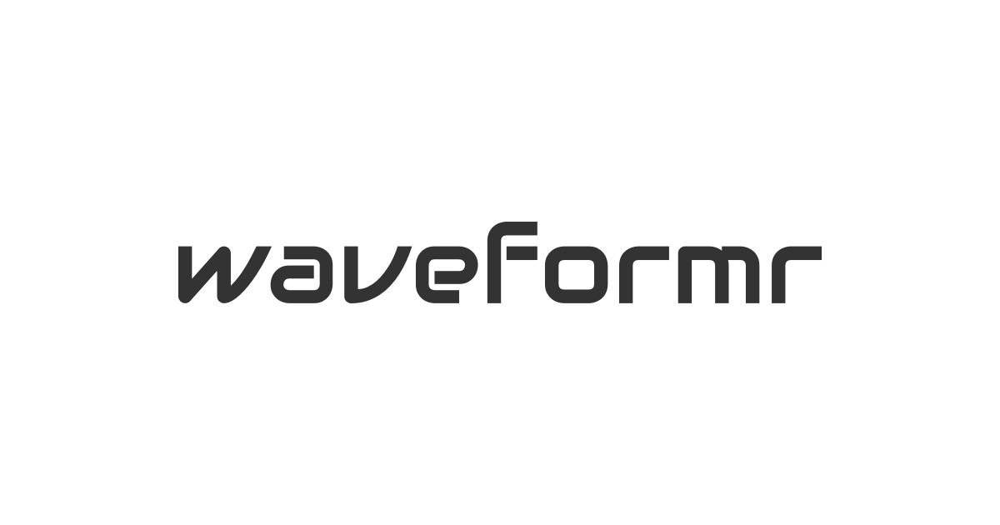

# Waveformr

This is a tool for generating SVG waveforms of audio files.
It uses [waveform-data](https://github.com/bbc/waveform-data.js) and the Web Audio API to build data points and
uses those points to write SVG `path` elements.

## Acknowledgements

- [waveform-path](https://github.com/jerosoler/waveform-path)
